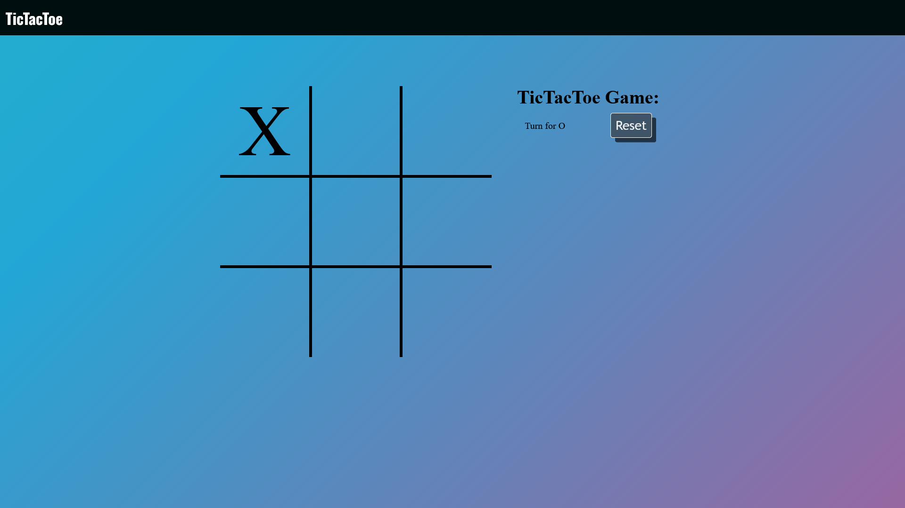
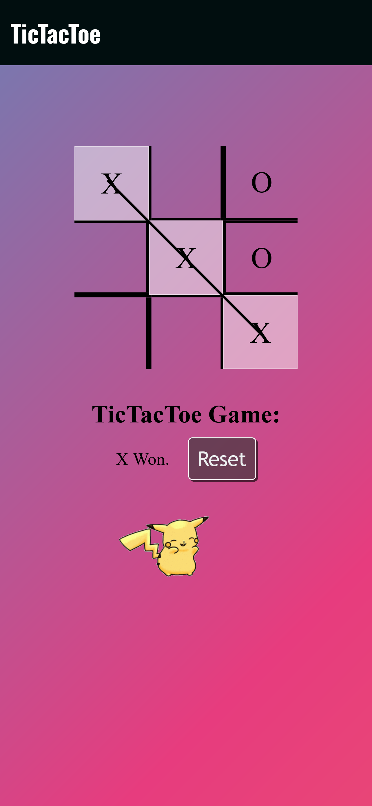
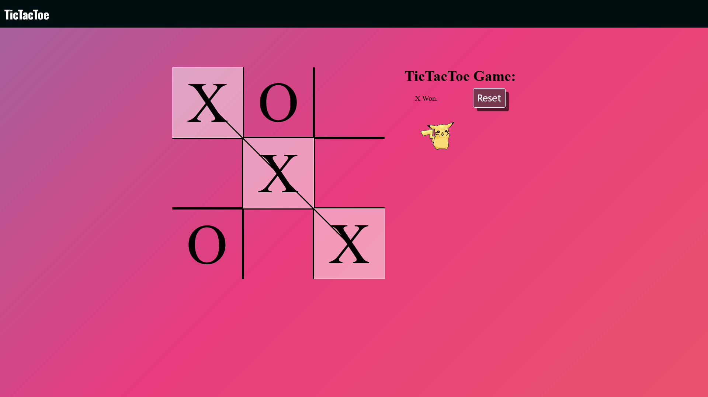

# 🎮 Tic-Tac-Toe Game

A simple and interactive Tic-Tac-Toe game built using HTML, CSS, and JavaScript.

## 🖥️ Live Demo

Play the game online: [Tic-Tac-Toe Live](https://arijitkayal-gm.github.io/Tic-tac-toe-/)

## 📸 Screenshots



*Game board in the middle of a game.*


*Player X wins the game in a PC.*



*Player X wins the game in a mobile.*

## 🚀 Features

- **Two-Player Mode:** Players X and O take turns.
- **Win Detection:** Alerts when a player wins.
- **Responsive Design:** Compatible with various screen sizes.
- **Restart Option:** Reset the game at any time.
- **Animated Background.

## 🛠️ Technologies Used

- HTML
- CSS
- JavaScript

## 🔧 Setup

1. **Clone the repository:**
   ```bash
   git clone https://github.com/arijitkayal-gm/Tic-tac-toe-.git
